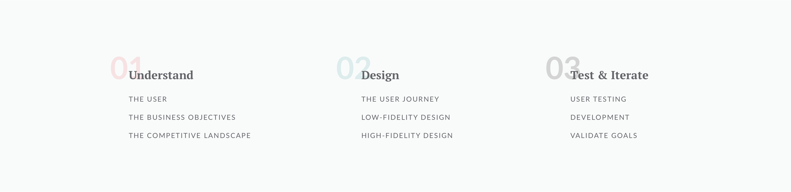

  <h6>My Design Process</h6>
  <h1>
    In an ideal situation this is the design process I follow every time.
  </h1>

  

    
Step 1

    
Understand

    
Before anything else, I seek to learn and understand three things: 

    

      
1. The user

      

        
Who is it that we’re serving with this design? What are their pain points?

        
Validate the answer to these questions through customer research - directly talking to them. I’ve found phone calls to be the best method for validating at this stage. Surveys, when done well, can work well too.

        
The goal here is to not only understand and validate the customer but also their points points. We want to ensure that they're truly a pain point and they're "painful" enough to be worth solving.

      

      
2. The business objectives

      

        
How will success be deteremined and measured? What are the outcomes we would like to see from a business perspective?

      

      
3. The competitive landscape

      

        
Which of our competitors also offer this feature? How are others solving this same problem? How can we differentiate ourselves?

      

    

  

  

    
Step 2

    
Design

    
Once we understand the fun can begin. I like to break this phase up into three steps:

    

      
1. User journey mapping

      

        
This is a high level view of the step-by-step experience the customer will go through. When you think of the whole users experience - the end to end flow - this is it. 

      

      
2. Low-Fidelity Design

      

        
The idea here is to focus on visual heirarchy and is one of the most critical design steps. It helps flesh out which elements should be in the interface and are most important and how they relate to one another.

      

      
3. High-Fidelity Design

      

        
I take the low-fidelity design and make it an actual design with colors and images and textures and patterns. Although the design is not done yet, it finally feels real and is very satisfying.

        
Keep in mind that we are still guessing at a design solution. We still need to validate which parts of this design work and, most importantly, which don’t.

      

    

  

  

    
Step 3

    
Test & Iterate

    
Remember to use data in order to inform design changes. That’s what this step is all about:

    

      
1. User testing the design 

      

        
It’s time to put the design in front of users. In my experience usability testing like this yeilds the most helpful information on the success of this design sprint.

        
I typically run user tests in batches of 3-5 users. By then I will have identified where the usability problems are. I redesign the problem areas and re-test until we’re confident.

      

      
2. Develop Designs

      

        
Putting pixels to code.  Depending on my role, I’m not always the one doing it. I love this step, whether I’m the one writing the code or not. :)

      

      
3. Validate Design Goals

      

        
In step one we identified goals that would determine success. Now it’s time to measure those goals. Typically this involves analytics software - hotjar, google analytics, kissmetrics, etc.

        
It's important that a regularly scheduled meeting (I find monthly is a good time interval) is set to review the results and to determine actions that need to be taken. Typical actions are re-designing and re-test a certain aspects of the interface, measuring something we missed previously, and so on. I love that all actions are based in data not opinion.

      

    

  

