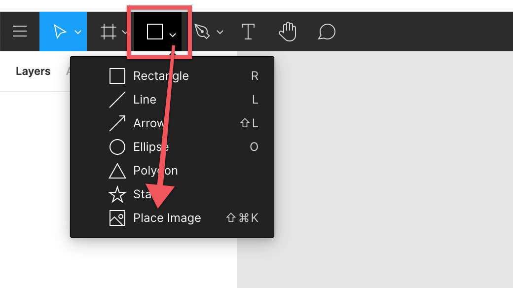
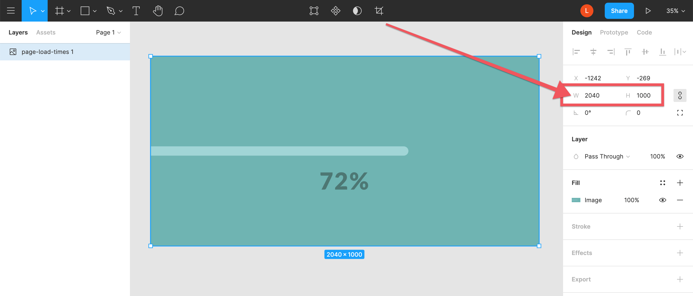
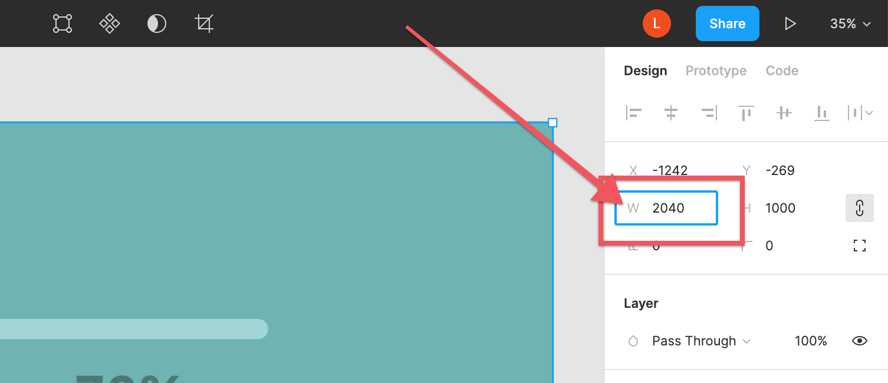
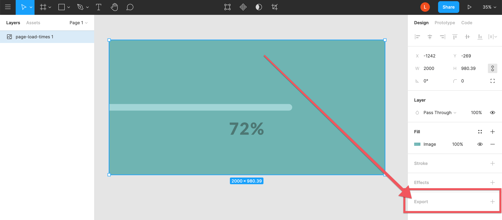

###### Don’t Lose customers or traffic

# The easiest way to speed up your website page load times.

We’ve all done this before.

You go to a website and it loads… and loads… and loads… 😠

It’s frustrating especially if you really want to read or see what was on the page. How long are you willing to wait? 1 second? 2 seconds? More?

Most people used to be willing to wait around 3 seconds. Now people are only willing to wait between 1 to 2 seconds.

So, if you have a website you’ve got to get this right. You don’t want to frustrate your customers OR lose traffic. But what do you do? Where do you start?

One of the biggest culprits of slow page load times is the images on your page that are too big.

The good news is that this is easily solved.

## Step 1 - Find those monster images

First, you want to evaluate every single image on your website. Yes, that includes every single image on every single page of your website.

If you know where your images are stored then you just want to open up your CMS or folder or wherever your images are located. Download each of the images onto your computer. Now you can move on to step 2.

If you don’t know where your images are located just open up your website and look at every single page. Does it have an image on it? If so, right click on the image and choose to download the image. You want to do this for every single image on your website.

Once you’ve downloaded all your images it is easiest if you’ve stored them all together in the same folder. Now you’re ready for step 2.

## Step 2 - Reduce the actual dimensions

Once you have your images you want to make sure they are an appropriate width and height. In general you want to keep your images within 2000 pixels. None of your images will need to be larger than 2000px.

If your image will go at the top of the page and be a special header image [this article will walk you through handling those special case images](./header-image-sizing-guide).

If you have a design tool you use to modify images feel free to use the tool that makes you the most comfortable. If you don’t, I recommend [Figma](https://www.figma.com/). Go there and create a free account. Once you’ve created your account login and open up a blank document.

Click the dropdown shapes tool and select place image:

You can now find the image from your computer. Click anywhere on the canvas to place the image.

Now select the image and you will be able to see the image dimensions in the design window on the right side of the page:

If your image is less than 2000px you can go to the next image.

If the image is larger than 2000px you will want to simply click next to the W:

And change the size to either 2000 or less.

Once you’ve got your image resized you’ll want to click on it and at the bottom of the design window on the right hand side of the screen click “Export”.

Choose the file type (typically you’re going to want to stick with png or jpg). And click export.

Now go through each of your images and get them to appropriate sizes.

If you have any troubles resizing your image here’s an article that will [walk you through some alternatives methods of resizing](https://www.digitaltrends.com/computing/how-to-resize-an-image/).

Once you’ve resized all your images you’ve done the hardest part. Now you can go to the last step.

## Step 3 - Minify the image

The main purpose in reducing the dimensions of your images to less than 2000px is to get your images to the smallest possible size in terms of bytes. To do this all you need to do is go to [TinyPNG](https://tinypng.com/) and drop or select your images (you can do 20 at a time).

Once they’re done compressing, download the image.

At this point they should be less than 400kb.

If you’re not sure how big 400kb is consider this: 1000kb = 1mb. So 400kb is less than 1/2 of a megabyte.

As a general rule, you should never include an image a megabyte or larger on your website.

If your image is larger than 400kb and it’s the appropriate dimensions then the problem is probably the image type. If it’s a .png export it as a .jpg instead and if it’s a .jpg export it as a .png instead. Then compress it and go with whichever one is smaller.

You want to try to get it below 400kb but if you’re just over that and have tried the following things:

- reduced the dimensions beyond 2000px to 1600px or smaller.
- used tinypng to minify the image in both jpg and png formats and then downloaded the smaller version of the two

If you’ve done both of those things I’m going to guess that your image is close to 400kb. And in that case I’d recommend using that image and going onto the next image.

Once you’ve minified each of your images you’ll want them to replace the big images on your website with these smaller images.

## Most important points to remember

Don’t frustrate or lose customers simply because you didn’t take a few minutes to reduce the image sizes on your website. It’s not hard and only takes a few minutes.

Before putting any images on your website make sure they’re no larger than 2,000 pixels wide or tall. And try to make sure every image is 400kb or less.

It’s one of the easiest and fastest ways to speed up your page load times on your website.
