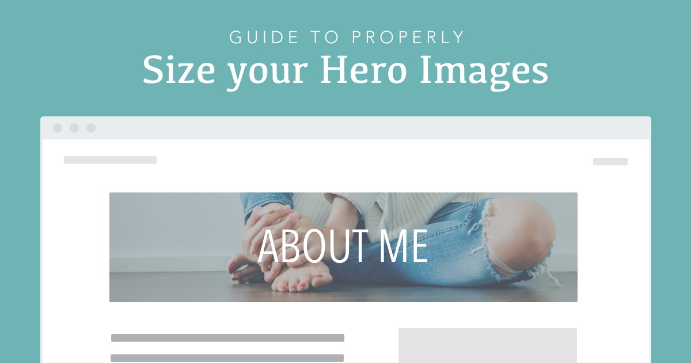
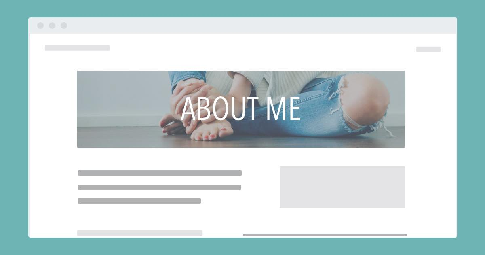
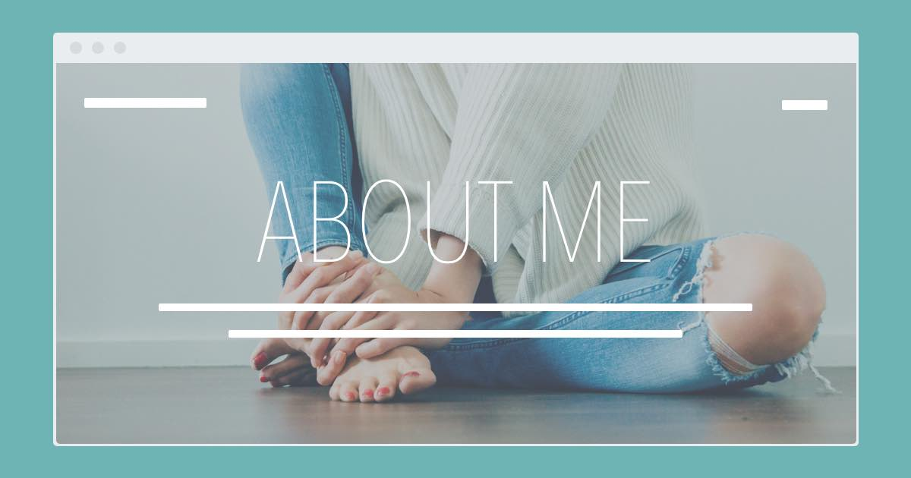

###### How I Size My Header Images

# Guide to Properly Size Your Hero Images and Optimize Them for Site Speed



If you're like me you've run into this too many times to count.

Your web page needs a new image for the hero section or top part of your page. You want this image to be large enough for any size screen but not so large that it will significantly slow down the load time on your page. You don't want it too tall either.

You've done this a bunch of times but each time you open up your design tool to create your hero image, you can never remember what size that hero image should be.

You know the first thing is to get the dimensions of the image right.

## Your go-to sizing guide for hero background images



If your image is going to be header/hero background image you'll want it to be long and not too tall. I make my header images 1600 x 500px.

## Size those full page background images correctly too



If you're creating a full page background image you'll want these images to be a bit taller. I make these images 1600 x 1000px or sometimes 1920 x 1200px. I usually do both sizes and then compress them. If the larger image compresses well and isn't too large (still under 400kb) I go with the 1920 x 1200px sized image.

## Don't forget how an image might look on mobile

You will want to look at your image on both desktop and mobile. These image sizes typically look best on desktop. So, take a look at them on smaller screens to make sure it still looks good.

If it looks good on both jump down to the next section.

However, if it looks good on desktop but is a little too small on mobile you'll want to create a specific image for mobile.

When this is the case I switch out the hero image (using a media query) so that on mobile it shows the mobile image and on larger screens it shows the regular hero image. I typically make my mobile images 800 x 1200px.

You can swap out your hero and mobile images in your CSS like this:

```CSS
.hero-image {
  background: url('my-mobile-hero-image.jpg') no-repeat center top;
  background-size: cover;
}
@media (min-width: 768px) {
  background: url('my-hero-image.jpg') no-repeat center top;
}
```

This would show your mobile image on any screen smaller than 768px wide. If the screen size is larger than 768px it would show your background image.

## Use my [Sketch](https://www.sketch.com/) template

To make things easier for you feel free to [download the sketch template I use](http://photos.lauraleeflores.com/n8Ji/hero_image_template.sketch). It has an artboard for the header image, a full page image and a mobile image.

Hopefully this will save you time and energey the next time you need to create an image for your website. :)

## Image Optimization

Once you know the height and width of your image you want to shift your focus to minimizing the size of the image so that it doesn't have a significant negative impact on page load times.

Sometimes a jpg is smaller and sometimes a png is smaller. Typically, for this type of image the jpg is going to be smaller. But, if you're unsure simply export both the jpg and the png and see which one compresses to a smaller size.

Now you'll want to compress your image to make it the smallest possible size without making it pixelated.

As a general rule try to reduce the size of your image to be at around or smaller than 400 kb.

## Image Compression Tools

If you haven't done this a thousand times already you should do this for every single image you put up on your website. Every time you do this you are in essence speeding up the load time of your web pages.

Probably the easiest way to compress your images is to just go to [Tiny PNG](https://tinypng.com/).

If you want a tool that will give you more control over the compression and one that you can use anywhere and anytime without the need for an internet connection consider [PNG Compressor](https://itunes.apple.com/us/app/png-compressor/id434886325?mt=12) (macOS app for png images) and [Compressor](https://itunes.apple.com/us/app/compress/id405850942?mt=12) (macOS app for jpg images).

## Summary

[Download this sketch template](http://photos.lauraleeflores.com/n8Ji/hero_image_template.sketch) to know what size to make any hero image on your website.

Once you've created the image export it and compress it so that it's the smallest size it can be without being pixelated (hopefully less than 400kb).

And remember to only put images on your website that have been compressed!
