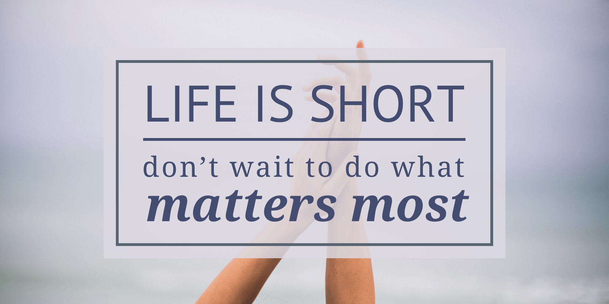

# One Lesson From Losing My Brother

It has been 6 years today, since my brother passed away. The pain and grief at such a loss has been deep and indescribable. He was only 35. Today he would have been 41. It’s hard to find the words to describe what a loss like this has had on my life and the rest of my family - especially his wife and three daughters.

Aside from a congenital heart condition (that we never even thought about because it never really affected him) he was extremely healthy.

He had open heart surgery to fix the problem with his heart. The surgery seemed to have gone great. He was recovering really well. He had gone home from the hospital and we thought he was going to be fine, better than fine actually. He was doing great and in no time he would probably feel better than he ever had. Or so we thought.

A few nights after being home from the hospital he suddenly and unexpectedly passed away. That day he had felt so good and even had said, “I am just so happy.” He had a life and family he loved and that loved him.

We never would have guessed that his life would end that day - or any day soon. It has taken me a while to write down one of the things that this terrible loss has taught me. It is this:

We aren’t in control of how long we or our loved ones get live.

There is no guarantee, unfortunately, that we will even get to survive this day.

So, what should we do with this realization?

Two things stand out to me this morning as I write this:

The first is to love and show that love to those close to you. Make memories with them. Cherish the time you do have. Do things together. Be present with them. Love and enjoy them.

The second is to reach for your dreams. Don’t let fear or anything stand in your way. Do the thing you feel you were born to do, the thing you have been dreaming of but haven’t gotten around to. Don’t wait around to be the best version of yourself.

You never know what moment will be your last.
