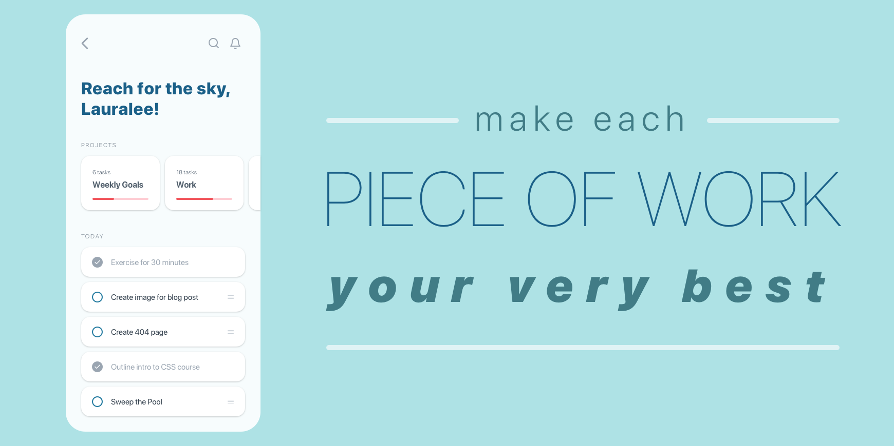

import { Link } from "gatsby"

# Do Your Best Work

I love the work I do. I really, really love it. I wake up excited to express myself through my work. I feel like I’m doing the thing I was born to do.

That doesn’t mean that it is always easy and that I want to do it all the time. In fact, there are times when it is <Link to="/blog/big-problems-big-opportunities">incredibly difficult</Link> and even unpleasant.

I have my moments when I must just do the work. I must persevere. I’m not doing it because I love every minute of the process.

I am doing it because I agreed to do it and I am going to love the outcome. I'm doing it <Link to="/blog/why-i-set-goals">to become</Link> the person I want to become. I am doing it to <Link to="/blog/big-problems-big-opportunities">change the world</Link>.

Don’t let that mistake you. I will do more than just try. I will do more than just go through the motions. And most importantly, I will do more than what is required or expected of me.

No matter how I feel. Whether I'm loving the process or not.

And I'm not talking about working all day and night and weekends. I'm talking about the **quality of the work**. Not quantity.

I'm also not talking about perfectionism. I know that sometimes what I create in the time I've allotted isn't up to the quality I want.

And that's okay.

It's normal even.

That doesn't mean I didn't put in my very best effort.

And that's exactly what I'm talking about.

I will do and be my very best to over deliver in the time that I have. I will stretch myself. I will work deeply.

Even when what I create isn't perfect. _**I still work and plan on the next thing being the best I've ever created.**_

And so should you.

