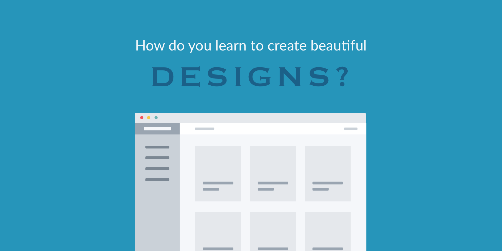

import { Link } from "gatsby"

# How do you learn product design?

Whether you want to be a product designer or you simply want to know how to design beautiful interfaces, this article is for you.

Maybe you want your beautiful designs to make you money. Or you simply want them to convey and portray you or your company in the right light.

The problem is you're not sure **what** you need to learn or **where** to start.

You're also worried about where you're going to "get inspiration" for all your designs. What books you should read, which YouTube videos you should watch, which audio books you should you listen to, and which designers you should follow?

To answer your question we need to go back to 2014. I published a blog post (on my previous website) titled _I’m not a designer_. When I wrote that post I truly did not believe myself to be a designer.

Looking back I think part of the reason I felt that way is because that was never my intent - to become a designer. I just wanted to be able to create beautiful designs consistently for the web apps I was building. At the time I didn't realize that's exactly how you'd define a designer...

Let me walk you through what I did leading up to that blog post.

It was really simple. One thing actually.

Starting in 2007 I began designing web apps and websites (personally at first and then professionally).

Yes, you read that right. I didn't know how to design.

I just started.

For those 7 years - from 2007 to 2014 - **I designed something almost every single day**. I still do, to this day.

Here's the amazing part. Looking back over the projects I did and the work that I completed I could see a slow, gradual improvement. _I was consistently getting better._

Not only was I getting better, I was starting to notice design trends and simple tricks to apply to all designs.

I could design in different styles - for one project I could create a flat, modern, and minimal design and for another I could create a fun and playful design with lots of color and depth.

Perhaps the biggest realization of all was that designing was becoming easier and easier the more I did it. What, was at first hard for me, was now effortless. And I was _much_ faster.

A few months after that post about me not being a designer was published back in 2014, I accepted a full-time position as a Product Designer. 🤦‍♀️ 🤷‍♀️

I didn't apply for the job. They came to me. I wasn't even sure I wanted the job at first. And it wasn't an entry level design job either. It was for the Lead Product Designer position at a really great company.

And guess what? I was only hired because they saw my designs. **They saw what I could do.**

Now maybe you don't want a design job. You just want to create beautiful designs consistently. I get it.

Regardless of the outcomes you're seeking, if you want to be able to create beautiful designs then **start by designing something**.

Don't let yourself get too hung up on what you don't know right now. Design is a skill. It's something you can learn whether you consider yourself creative or not.

Please don't wait for inspiration. You don't need to read a bunch of books, watch a bunch of YouTube videos, complete a design course, or any of those things.

You can do what I did.

It worked for me.

I simply designed something every single day <Link to="/blog/do-your-best-work">even when I didn't feel like it</Link>.

Sometimes I wasn't sure how to design something. So, I looked around for beautiful designs to give me ideas. I created a [pinterest board](https://www.pinterest.com/lauraleeflores/flat-minimal-design-inspiration/) that I needed for a long time to give me design ideas and direction. I also used [dribbble](https://dribbble.com/).

And for a long time I [stole like an artist](https://www.amazon.com/Steal-Like-Artist-Things-Creative/dp/0761169253).

So here's what I'm trying to say: **Becoming a designer, or being able to create beautiful designs, is your choice**.

All you have to do is start with one small part of some interface on your current project. Start wherever. Just design _something_.

You will find that you are learning more by doing design than by listening, reading, or thinking about design ever could teach you - especially as you first begin.

As you get farther along, if you find that your reading, listening, or thinking about design doesn't actually impact your designing then stop. It's not helping.

_The quality of your design work is always the guage and should always be your focus._

### My Challenge to You

I challenge you to design something today. I don't care how big the thing is you choose to design. It can be a button. In fact, I encourage you to start small.

Don't try to create the perfect design, whatever that is. Just try to improve on what you currently have. And continue improving.

You may be like me when I first started and need to look at other high quality designs in order to get ideas on how to improve your design. If so, look around if you find it helps you. But, that's not the focus. Don't let it slow you down. Just design something.

What's the worst that could happen?

Maybe you design something absolutely hideous. That will still teach you so much about what not to do next time. And then you can take that design and improve it. You will learn so much this way!

So, what are you going to design? Go do it now.
