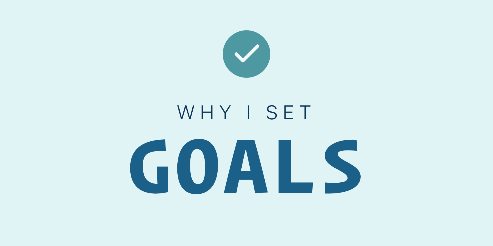

# Why I Set Goals

I am an avid goal setter. I live by my goals.

My day starts reviewing my goals for that day. And ends with a review of what I was able to accomplish and what I can reasonably expect to accomplish the next day. Every week I do a weekly review of all my goals.

One thing I've found interesting is that the most meaningful goals aren't valuable just in the accomplishment of the goal.

Marking it as complete isn't even the purpose of many of them.

Don’t get me wrong, I want to accomplish my goals and I will do everything in my power in order to do so.

In fact there are plenty of goals I simply need to accomplish. Stuff that I just need to get done. Some items for work, cleaning my house, etc.

But there are others that have changed me.

Back in 2008 I set a goal to build [Major Finder](http://majorfinder.com/).

When I started I had never designed a website or a web application. I had never written a line of code.

It was built from the ground up three separate times over the course of many years.

Some of the outcomes of that goal were that I had learned to design. I also learned Ruby on Rails and a bit of Javascript.

I started blogging.

That goal changed my life.

I started focusing on goals like this that would change me into _a different sort of person_ - a better version of myself.

These type of goals take time. They're big and difficult.

When you set a goal like this you will soon realize that in order to accomplish it _**you will have to become better**_ in some way.

After achieving the goal, you will realize that you can now set a harder or more challenging goal the next time because _**You will be more capable of achieving it**_.

All of my big goals I set in order to _become_ a different, better, more knowledgeable, more skillful person. My goals are meant to help me become [my desired future self](https://benjaminhardy.com/how-to-become-your-future-self/).

Years ago I read the following passage:

> Let me share with you an intriguing thought. The real value in setting goals is not in their achievement. The acquisition of the things you want is strictly secondary. The major reason for setting goals is to compel you to become the person it takes to achieve them. Let me explain.
>
> What do you think is the greatest value in becoming a millionaire? Is it the million dollars? I don’t think so. No, the greatest value is in the skills, knowledge, discipline, and leadership qualities you’ll develop in reaching that elevated status. It’s the experience you acquire in planning and developing strategies. It’s the inner strength you’ll develop to have enough courage, commitment, and willpower to attract a million dollars.
>
> Give a million dollars to someone who doesn’t possess the attitude of a millionaire and that person will most likely lose it. But take away all the wealth from a true millionaire and in no time he or she will build a new fortune. Why? Because they have the knowledge and experience to duplicate the process again and again.
>
> As you can see, when someone becomes a millionaire, the least important thing is what they have. The most important thing is what they have become.
>
> - 7 Strategies for Wealth and Happiness by John Rohn

This book and this passage in particular has had a huge impact on my life.

It led me to connect who I wanted to become with my goals today.

It also made me consider how I could reverse engineer my future self. What knowledge did my future self have that I needed to start developing?

What skills and experience do I need to start getting in order to become my future self?

These are the type of questions I began asking myself and thinking about when setting my goals.
