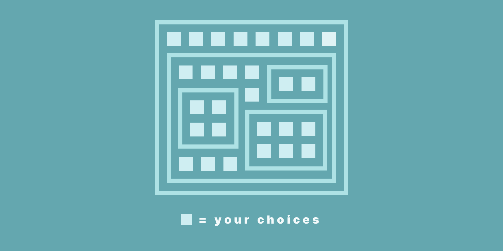

import { Link } from "gatsby"

# There Are No Small Choices

The small, seemingly insignificant choices we make each day shape our future and our destiny. They define our life.

Today I heard the story of [Oseola McCarty](http://www.wikiwand.com/en/Oseola_McCarty). A humble washerwoman who is inspiring in many ways.

One of the things she did was so simple and yet it resulted in hundreds of thousands of dollars.

She was poor and made very little money.

She would only earn nickels, dimes, and quarters each day.

Whatever she made, she would walk (she never even had a car) to her bank and deposit the change.

She did this every day for years and years. 

Here's what's amazing about this story. She was consistent. Every day she deposited her change in her account. 

Slowly that change grew. Her persistence and patience paid off. Her small handful of change deposited daily eventually grew to hundreds of thousands of dollars. 

She then gave it away in a beautiful and moving way that changed other peoples lives for the better.

All because she did <Link to="/blog/how-do-you-learn-product-design">something small every day.</Link>

What is our life anyway? It's nothing more than a string of well lived days.

So, what is something small that you would like to do each day in order for it to grow into something big?

Is there a skill you'd like to learn? An mount of money you could set aside regularly?

Or maybe it's the type of person you'd like to become. Determining to perform an act of kindness or generosity, no matter how small, will turn you into a better person.

Small acts done each day will grow into something much bigger.

It's [the compound effect](https://www.amazon.com/Compound-Effect-Darren-Hardy/dp/159315724X) in action.

You may not see results after the first week, month, or even year. But if you're patient and willing to wait, you will see big results.
