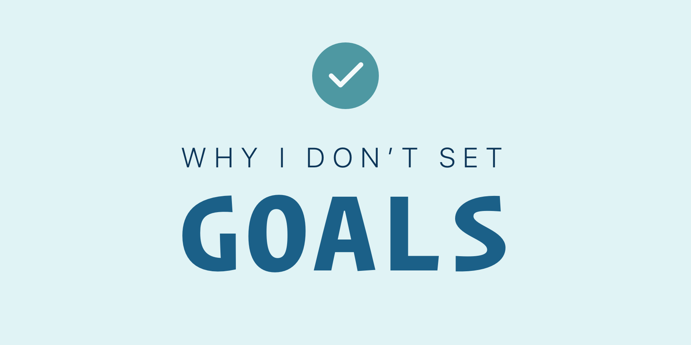
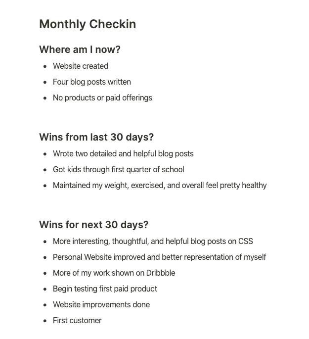

# Why I Don't Set Goals

I used to be an avid goal setter. I lived by my goals.

My day would start with a review of my goals for the day. And it would end shuffling around what I didn't get done and what I needed to do tomorrow.

I lived to check off a task for the day. And when things came up and I wasn't able to get them all done I would begin to stress.

On days where I did excellent work I still found myself feeling stressed and unsatisfied if I hadn't checked off all my tasks for the day.

I would start to wonder how I would get tomorrow's tasks done on top of the ones I didn't finish today.

Then I read [It doesn't have to be crazy at work](https://basecamp.com/books/calm) and one of the ideas Jason Fried and David Heinemeier Hansson put across in that book was that they don't set company goals for Basecamp.

I never thought about not setting goals for myself. It literally never crossed my mind. I felt so tied to my goals. Almost like I couldn't be me without them.

But, I started to wonder what my life might be like without goals.

Would I still be highly productive and engaged? Would I still get stuff done?

Was it my goals that lead me to do better work? Did they make me better at what I did? Was it my goals that gave me direction?

I decided to try it out. I experienced life without a set of to-dos that I needed to check off the list that day.

And I felt free for the first time in, well, I couldn't even remember. Suffice it to say it was a long time.

I realized that, if anything, my goals were getting in the way of me doing my best work.

I didn't realize it until I stopped setting goals, but they would get me so bogged down with checking off my tasks for the day that I wasn't as focused on my bigger objectives.

I also wasn't able to relax at the end of the day if all my tasks weren't complete.

After freeing myself from my goals I was finally able to calmly focus on simply doing my best work. I am happier, more flexible, and less stressed.

I am still trying to figure out what is the right arrangement for my health and productivity.

This is what I have figured out so far.

## 1. Monthly cycles

I work in one month cycles. For my personal goals this time frame works best.

The folks at Basecamp work in 6 week cycles.

And I also experimented with 12 week cycles after reading [The 12 Week Year](https://www.amazon.com/The-12-Week-Year-audiobook/dp/B00KN00GDI).

I can see myself changing to a different amount of time. For now though the month time frame is working really well for me.

The month is something I'm used to referring to daily. I know intrinsically when the month has just begun, if I'm halfway through or nearly at the end.

It's also not a huge commitment. I'm not committing a quarter of the year going a direction that might not be right for me. I only need to invest in a direction for the next 30 days. Then I can re-evaluate.

30 days takes a lot of pressure off while still giving me enough time to get a good chunk of work done in that time frame.

## 2. The Monthly Check-In

Before starting the month I do a check-in. Here's my checkin for this month:

One of the areas I explore are possible wins for the next 30 days.

These are not goals or action items. This is me exploring. Putting it out there to see how it feels.

It's almost like dreaming. If the next 30 days went perfectly, what would my world look like at the end of the month?

It gives me an idea of the direction I want to go. It paints a picture of what I want to create in my own life.

You can see that one of the things that is on my mind is to better represent myself and my work on my personal website and dribble.

Another area is on creating a paid product.

This leads me to creating some desired outcomes.

## 3. Monthly outcomes

Exploring possible wins for the month helps me to hone in on what I want to accomplish. What outcomes I'd like to see.

These are not goals. They're direction for me to go.

Every day this month, for instance, I am thinking about how I can be more transparent about myself and my work.

I'm also focused on creating a paid product and writing quality content.

Two months ago I was focused on designing and creating [CSS Academy](https://www.cssacademy.com/).

Each day of the month I do my best work on one of my objectives. I do as much as I can with the time I'm given.

I feel calm. Focused. And really happy.

I also feel productive and find a great amount of joy and fulfillment in the work I accomplished.

I almost never felt this way when I was setting goals.

## 4. Could I? 

I sometimes get curious. 

My curiosity drives me to try things I might not have tried otherwise. 

For instance, I have a product idea in mind for CSS Academy. This month I will be dedicating some time to writing my pitch for this product. 

At the beginning of my deep work block I might ask myself: "Could I write a rough draft of the entire pitch before the end of my deep work session?"

It's not a goal. 

It's a curiosity. It's playful. 

There's also no pressure. 

I would spend the next 90 minutes seeing if I could draft my entire pitch. 

If I do, interesting! If I don't, also interesting. 

Try curiosity. You might find it works better than goals ever did. And it always leaves you feeling good. 

## Focus on Becoming

Instead of focusing on doing and accomplishing, I'm focused on becoming.

I have a vision for myself and my future. Each day I am calmly working towards creating it.

Years ago I read the following passage:

> Let me share with you an intriguing thought. The real value in setting goals is not in their achievement. The acquisition of the things you want is strictly secondary. The major reason for setting goals is to compel you to become the person it takes to achieve them. Let me explain.
>
> What do you think is the greatest value in becoming a millionaire? Is it the million dollars? I don’t think so. No, the greatest value is in the skills, knowledge, discipline, and leadership qualities you’ll develop in reaching that elevated status. It’s the experience you acquire in planning and developing strategies. It’s the inner strength you’ll develop to have enough courage, commitment, and willpower to attract a million dollars.
>
> Give a million dollars to someone who doesn’t possess the attitude of a millionaire and that person will most likely lose it. But take away all the wealth from a true millionaire and in no time he or she will build a new fortune. Why? Because they have the knowledge and experience to duplicate the process again and again.
>
> As you can see, when someone becomes a millionaire, the least important thing is what they have. The most important thing is what they have become.
>
> - 7 Strategies for Wealth and Happiness by John Rohn

This book and this passage in particular has had a huge impact on my life.

Each day I wake up clear on who I want to become. And I work towards that vision.

I do better work. I'm more creative. I'm less stressed. I can better see what I've accomplished instead of what to-do's I wasn't able to get done. 

Try freeing yourself from your goals. Who knows, you might find you're actually more productive and simply better without them. 