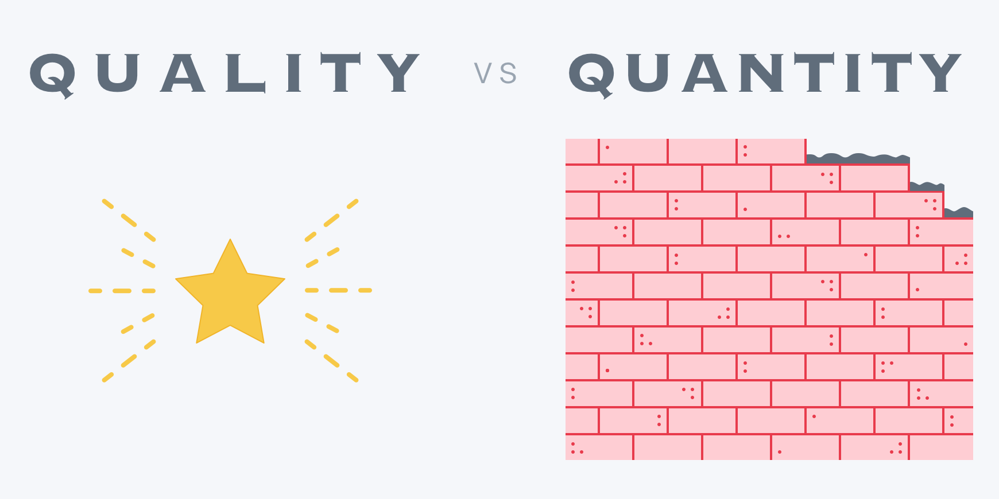

# Quality vs Quantity

I am constantly trying to become better at the work I do.

It's more than that, actually. I'm seeking to become excellent.

In this pursuit I see two different ideas.

### Quality or quantity?

The first is the idea that creating a lot of work leads to excellence.

This idea suggests that you simply put in your reps and you'll become great.

The second idea is that quality is 100 times more important than quantity. It's not about doing something a bunch of times but on doing it perfectly.

So which is it?

Where should you and I focus our efforts on becoming excellent? Quantity or quality?

### What does the research say?

I came across an interesting study done on pottery students where these two approaches were compared.

One group of students were told that for their final grade in the semester, it would be based on the best pot that they could create. Just one perfect pot. They would be graded on quality.

The other group of students were told to create as many pots as they could. The more pots they created the higher their grade. They would be graded on quantity.

The outcome?

The group of students who were graded on quantity learned how to create great pots and hugely outperformed the perfect pot group both in terms of quantity and quality.

The more pots they created the more they learned. The more they experimented. They also had more fun.

So, is quantity the answer?

I don't think it's as simple as that.

Quantity matters. There is no doubt that is true.

It is especially true for someone new to something.

When you're first learning how to code, draw, paint, design, speak a new language, or any other new skill, the amount of time you spend practicing that new skill is huge.

For the seasoned software developer or professional painter putting in the same old reps doesn't have the same kind of results.

To be clear, I believe **quantity matters at every skill level**.

With that said, **the better you are at something, the _quality_ of the reps begin to matter more and more**.

With each rep you need to ask yourself if that is your best work? Could you do it better? Or faster? Or in a way you've never done it before?

The idea is to continue to stretch yourself with each rep.

One of my favorite quotes is:

> The master has failed more times than the beginner has even tried.
>
> - Stephen McCranie

He is an artist and knows the power of putting in a large volume of work. Not every piece of work is going to be a masterpiece. Many of them will be failures.

Each rep should teach and sharpen your skill.

**_Quantity leads to quality_.**

At the end of the day, if a thing is done really well, no one is going to ask how many came before it or even how long it took.

In many ways, it'll look like an overnight success.

For a thing to be done really well though, it took time and patience and persistence. It likely took years of practice.

So, whether they're watching. Work at your craft. Put in your reps. Do your deliberate practice. Have fun with each one.

And remember, don't just put in your rep. **Make that rep your very best.**

Be creative. Try something new. Stretch yourself. Increase the level of difficulty of the rep. Make subtle changes to the rep to stretch and broaden your abilities.

Don't allow yourself to become complacent.

To reach excellence you need both quality and quantity.
