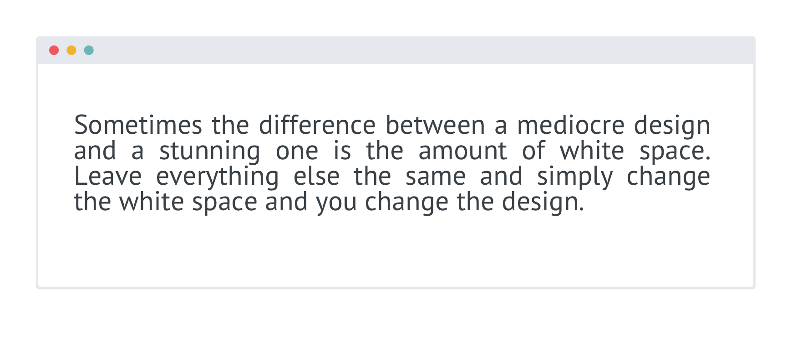
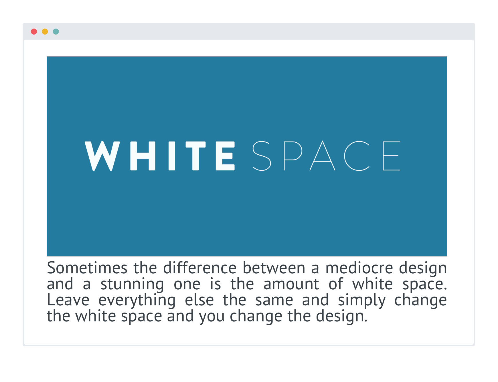
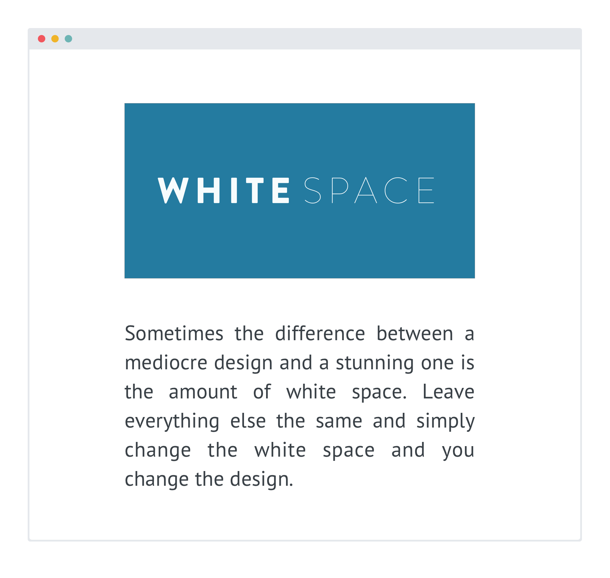

# White Space

Sometimes the difference between a mediocre design and a stunning one is the amount of white space. Leave everything else the same and simply change the white space and you change the design.

Whitespace is the empty space in-between elements. Here’s a simple example.

**No white space:**

**White space:**

Once you begin adding more elements it becomes even clearer. Notice the difference when I add only one additional element.

**No white space:**

**White space:**

This is even more pronounced when there's more elements in the mix. 

**No white space:**

**White space:**

White space can change a cluttered and confusing interface into one that is appealing, enjoyable, and even clear and easy to use.

So, add space between your text, your elements, and your groups of elements. For headlines I also often add space between the characters of each letter.