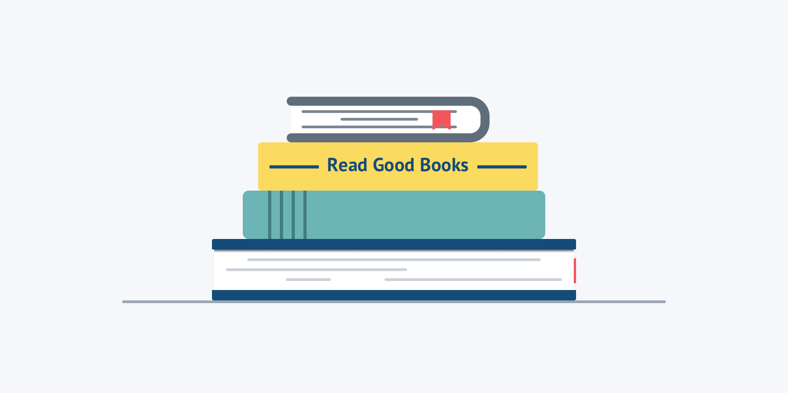

# Read Good Books

I love to read.

The books I’ve read have opened my mind, shaped my opinions, given me direction, and changed who I am. I have learned so much from them.

The person I am today is different _becuase_ of the books I've read.

The person I become will also be shaped in part by the books I read and re-read in the future.

Surround yourself with good books. Those that uplift and make you better.

If you aren't sure which book to pick up next, here are [a few that have had a profound impact on my life](/about/).

Invest in yourself by buying great books and then make the time to read or listen to them. And then apply what you've learned.

<!-- prettier-ignore -->
Who knows, that $12 book very well might change your life.
