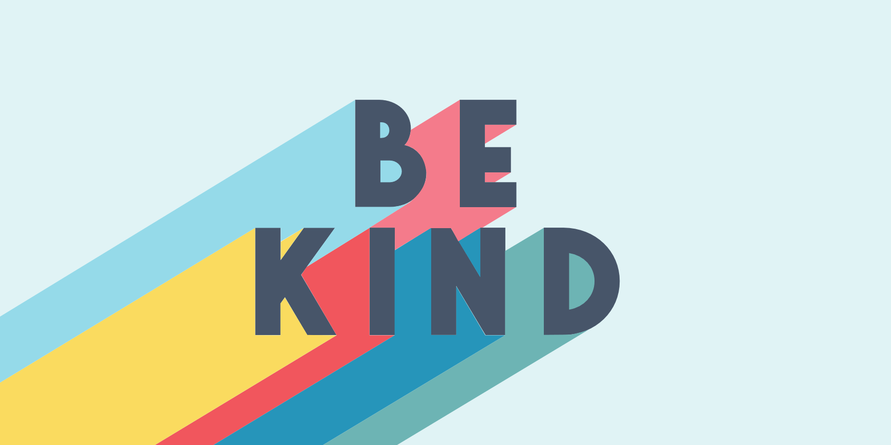

import { Link } from "gatsby"

# Be kind

Sometimes in life the simplest principles are the hardest to master.

Be kind to others.

It’s not complex.

It’s not hard to understand.

But sometimes it’s hard to do and to be.

I have been blessed to have married a master of kindness. For the past 15 years I have tried to become more like my husband, who is the kindest person I have ever known.

Pretty much anywhere we go people remember him and are excited to see him because he’s simply been kind and considerate to them in the past.

My kids think that we know everyone, but the truth is my husband is so incredibly kind that everyone remembers him.

He smiles (and he has a great smile!).

He talks to people.

And he is always looking for a genuine complement to pay each person who comes across his path, help them, hold a door open, or serve in any way he notices someone might need.

He asks people how they are. And genuinely cares. He listens. And when he sees them the next time, he remembers.

I could recount so many stories of good things that have happened in our lives all simply because he’s been kind. One that happened just this month, which is what prompted this post.

But, the truth is, I don’t think we should be kind because of something we’ll get out of it.

Maybe we should be kind simply because that is the person we’ve chosen to be. Or maybe it's because that person matters. Or maybe because <Link to="/blog/if-everyone-were-like-you/">that's how we would all want to be treated</Link>.

In our day to day life we are constantly given the choice to be kind or not. And choosing kindness isn’t usually the easiest path to follow.

However, from years of experience watching my husband and trying myself, I promise you that kindness is so much happier.

It brightens the world around you.
